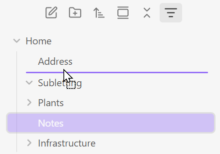

# Drag and Drop Sort

Plugin for Obsidian to provide custom drag & drop reordering in the File explorer.

## Overview

Drag and Drop Sort adds custom drag-and-drop ordering to Obsidian's File explorer. Files and folders can be freely interspersed, like in OneNote.



### Features

- **Fully Custom Sort Order**: Customize sort order by dragging and dropping folders or notes directly in the File explorer.
- **Handles Renames and Moves**: Keeps custom ordering through renames and moves.
- **Context Menu and Command Palette**: Alternatively, use context-menu items or the command palette to move items up, down, to the top, or to the bottom. The commands can also be assigned hotkeys in Settings → Hotkeys.
- **Reset Controls**: Reset a folder or an entire branch of descendants.

## Installation

### Community Plugins

Open **Settings → Community plugins → Browse**, search for **Drag and Drop Sort**, then select **Install** and **Enable**.

### Manual

1. Build the plugin:

  ```bash
  cd src
  npm install
  npm run build
  ```

2. Copy `src/dist/main.js`, `manifest.json`, and `src/styles.css` into `.obsidian/plugins/drag-drop-sort/`.

3. Enable **Drag and Drop Sort** under **Settings > Community plugins**.

## Usage

Drag any file or folder in the File explorer. A blue drop indicator shows where the item will land; release to commit the new order. Dropping between rows in another folder moves the item into that folder at that position. Hover over a closed non-empty folder for two seconds to expand it and reveal its child rows.

You can also right-click an item and use **Drag and Drop Sort commands** to move it up, down, to the top, or to the bottom. Right-click a folder and choose **Reset sort** to remove that folder's saved order, or **Reset sort (all descendants)** to remove the folder's order and all custom orders below it.

## How it Works

The plugin patches `getSortedFolderItems()` on the internal File explorer view, makes visible tree items draggable, and saves each changed folder's order to `data.json`. When a folder has no saved custom order, its currently rendered DOM order is captured when dragging starts before the new position is applied. Hovering over a closed non-empty folder for two seconds expands it through Obsidian's collapse control, then refreshes the visible order snapshot so positional drops remain consistent. Dropping across folders also moves the item through Obsidian's file manager. Hidden rows and unsupported file types are excluded from positional calculations so the drop position matches what is visible.

### Data Format

The plugin stores one simple object in `.obsidian/plugins/drag-drop-sort/data.json`:

```json
{
  "orders": {
    "Personal": ["Home", "Career", "Health", "Travel", "Finances"],
    "Personal/Home": ["Furniture.md", "Plants.md", "Kitties.md", "Assets"]
  }
}
```

Only folders you've actually reordered appear in this file. The order array contains item *names* (not full paths), and files and folders are freely mixed together.

## Versioning and Releases

This plugin is built and released using [the repository's `release.yml` workflow](.github/workflows/release.yml). It is versioned using [Semantic Versioning](https://semver.org/).

It is published as a community plugin, with release assets published to a corresponding GitHub Release:

- [GitHub Releases](https://github.com/summerdawn-ai/obsidian-drag-drop-sort/releases)
- [Drag and Drop Sort on Community plugins](https://community.obsidian.md/plugins/drag-drop-sort)

## Development

The TypeScript source lives in `src/`. Run the plugin in watch mode while developing:

```bash
cd src
npm install
npm run dev
```

Run `npm run build` for a production build.

### Chrome DevTools

To inspect the plugin in Obsidian's live renderer, close any running Obsidian instance and start it with remote debugging enabled:

```powershell
& "C:\Program Files\Obsidian\Obsidian.exe" --remote-debugging-port=9222
```

1. Confirm that the renderer is available at [http://127.0.0.1:9222/json/list](http://127.0.0.1:9222/json/list).
2. Attach a Chrome DevTools MCP or CDP client to the `webSocketDebuggerUrl` returned for the renderer target.
3. Evaluate JavaScript inside Obsidian's live renderer.

The `--remote-debugging-port` switch is documented in [Electron's command-line switch reference](https://www.electronjs.org/docs/latest/api/command-line-switches), and the `/json/list` endpoint and `webSocketDebuggerUrl` are part of the [Chrome DevTools Protocol](https://chromedevtools.github.io/devtools-protocol/).

## Contributing

Contributions are welcome. Please fork the repository, create a focused branch for your change, and open a pull request with a clear description of what changed and why; issues are also welcome for bug reports and feature ideas.

## Security

We welcome responsible security reports. Please contact the repository owner privately with the details rather than opening a public issue, so the problem can be investigated and addressed before it is disclosed.

## Acknowledgements

Drag and Drop Sort is an independent implementation based on the architecture and patterns of [Folder Sort Rules](https://github.com/wepee/obsidian-folder-sort-rules) by Adam. The `getSortedFolderItems` monkey-patch and per-item drag handler pattern are adapted from that MIT-licensed codebase.

## License

This project is licensed under the MIT License - see the [LICENSE.md](LICENSE.md) file for details.
